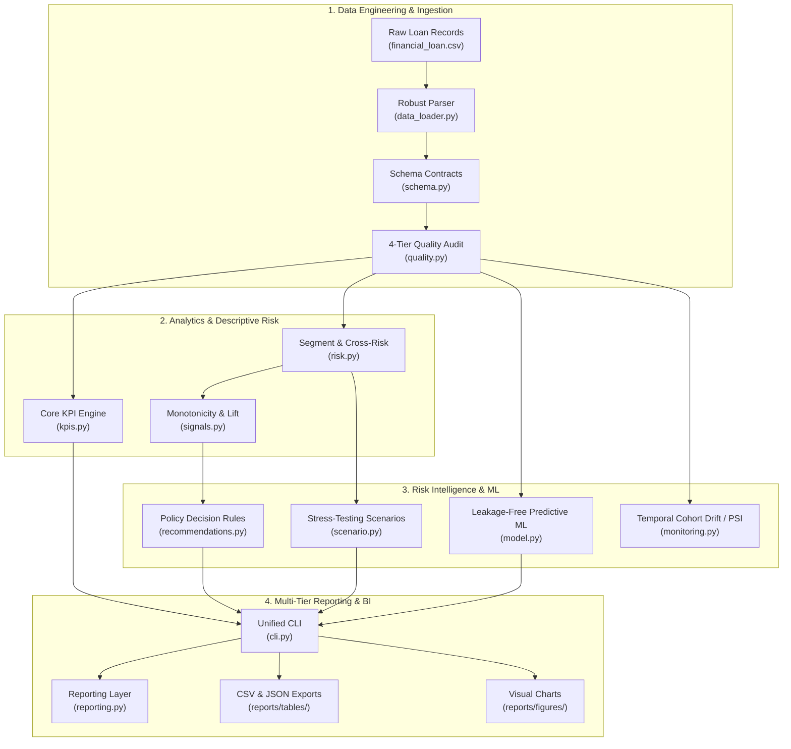

# Enterprise Bank Loan & Credit Risk Intelligence Platform

[](../../actions/workflows/ci.yml)


> **A portfolio-grade credit risk analytics and intelligence platform** engineered on 38,576 loans and $435.8M in funded capital. Integrates an audited data-engineering layer, deterministic financial reconciliation, leak-free predictive default risk modeling, cohort drift monitoring, stress-testing simulations, and a rule-based credit decision engine.

---

## 🏛️ System Architecture



---

## ⚡ What Makes This Advanced

| Pillar | Engineering & Methodological Depth |
| :--- | :--- |
| **Strict Analytics Contract** | 100% deterministic reconciliation across Python, SQL Server, and BI layers. All 38,576 loans ($435.8M funded, $473.1M received, 86.18% good / 13.82% bad) are asserted by regression tests. |
| **Enterprise Data Quality** | 4-tier severity model (`BLOCKER`, `ERROR`, `WARNING`, `INFO`). Generates machine-readable `data_quality_report.json` for CI/CD gates. Catches schema drift, domain violations, duplicate IDs, and unit errors. |
| **Cross-Segment Risk & Concentration** | Cross-segment interaction matrices (`grade × term`, `grade × purpose`, `income × DTI`) with configurable minimum-volume floors. Quantifies concentration via the Herfindahl-Hirschman Index (HHI) and cumulative Lorenz exposure curves. |
| **Leak-Free Predictive Modeling** | Trains exclusively on pre-origination underwriting attributes (`loan_amount`, `int_rate`, `annual_income`, `dti`, `term`, `grade`, etc.), isolating all post-origination outcomes (`total_payment`, payment dates). Evaluates Stratified Logistic Regression and HistGradientBoosting (ROC-AUC ~ 0.78, PR-AUC, Brier score calibration, 5-fold CV). |
| **Model Explainability Engine** | Transparent borrower risk attribution (`explain_borrower_risk`) returning risk rating tiers (Prime to Distressed) and primary driving factors rather than black-box claims. |
| **Temporal Cohort Drift & PSI** | Tracks distribution shift between historical cohorts (H1 vs H2 2021) using the Population Stability Index (PSI), missingness drift, and realized default rate shifts. |
| **Stress Testing & What-If Engine** | Simulates macro shocks (+25% default surge, 30% salvage recovery haircut, high-risk grade elimination, stagflation crisis) quantifying capital sensitivity and net margin impact. |
| **Deterministic Business Decisions** | Rules-based credit policy recommendations (`TIGHTEN`, `REPRICE`, `MONITOR`, `MAINTAIN`, `INVESTIGATE`) with triggers, observed metrics, rationale, and governance caveats. |
| **Production T-SQL Architecture** | T-SQL scripts validated statically with `sqlglot`, introducing Staging (`vw_stg_bank_loan`), Enriched Analytics (`vw_enriched_bank_loan`), and KPI Reporting views. |

---

## 📊 Reconciled Portfolio Benchmark Numbers

All figures are asserted by the automated test suite against the full 38,576 loan dataset:

| Metric | Portfolio Value | Methodological / Accounting Definition |
| :--- | :---: | :--- |
| **Total Loan Applications** | **38,576** | Count of distinct loan IDs |
| **Total Funded Capital** | **$435,757,075** | Sum of `loan_amount` disbursed |
| **Total Capital Received** | **$473,070,933** | Sum of `total_payment` collected (principal + interest) |
| **Net Cash Margin** | **+$37,313,858** | Cash-in minus cash-out (`total_payment - loan_amount`) |
| **Portfolio Recovery Rate** | **108.56%** | `total_payment / loan_amount` |
| **Good Loan Share** | **86.18%** (33,243) | `Fully Paid` (32,145) + `Current` (1,098) |
| **Bad Loan Share (Default)** | **13.82%** (5,333) | `Charged Off` loans |
| **Charged-off Salvage Rate** | **56.90%** | Recovery on defaulted loans ($37.28M collected on $65.53M bad loans) |
| **Net Credit Loss** | **$28,247,462** | Unrecovered principal on charged-off loans (6.48% of total funded book) |
| **Month-to-Date (Dec 2021)** | **4,314 loans** | $53,981,425 funded, $58,074,380 received |
| **Previous MTD (Nov 2021)** | **4,035 loans** | $49,933,400 funded, $53,757,794 received |

---

## 🚀 Quickstart & Execution

### 1. Installation

```bash
# Clone the repository
git clone https://github.com/aniket2404/bank-loan-report-analytics.git
cd bank-loan-report-analytics

# Create virtual environment and install package
python -m venv .venv
source .venv/bin/activate    # On Windows: .venv\Scripts\activate
pip install -e ".[dev]"
```

### 2. Comprehensive CLI Subcommands

The package exposes 12 dedicated subcommands:

```bash
# 1. Run Data Quality Audit (with CI exit codes)
python -m bank_loan_report validate
python -m bank_loan_report validate --json reports/quality_report.json

# 2. Executive KPI Summary & Overview Dashboards
python -m bank_loan_report report

# 3. Data Profiling & Null Audit
python -m bank_loan_report quality

# 4. Risk & Profitability Deep-Dive
python -m bank_loan_report insights

# 5. Cross-Segment Risk Interactions & HHI Concentration
python -m bank_loan_report risk

# 6. Leakage-Free Predictive Default Risk Benchmarking
python -m bank_loan_report model

# 7. Temporal Cohort Drift & Population Stability Index (PSI)
python -m bank_loan_report monitor

# 8. Portfolio Stress Testing & What-If Scenarios
python -m bank_loan_report scenario

# 9. Deterministic Credit Policy Recommendations
python -m bank_loan_report recommendations

# 10. Generate Visual Figures
python -m bank_loan_report charts --outdir reports/figures

# 11. Export Aggregations and Model Reports (CSV & JSON)
python -m bank_loan_report export --outdir reports/tables

# 12. Run Full Analytics Pipeline End-to-End
python -m bank_loan_report all
```

*(Add `--sample` to any command to run against the committed 600-row sample dataset without writing over full-book artifacts).*

---

## 🧪 Testing & Validation Suite

```bash
# Run full test suite (146+ unit, integration, and regression tests)
pytest -v

# Run static T-SQL validation
pytest tests/test_sql.py -v

# Run code style & formatting checks
ruff check src tests
```

---

## ⚠️ Methodological Limitations & Data Integrity

1. **Calendar Vintage:** The dataset spans a single calendar year (2021). Seasoning, vintage curves, and macroeconomic cyclicality spanning multi-year cycles cannot be inferred without multi-year observations.
2. **Known Date Inconsistencies:** As documented in [`docs/DATA_QUALITY.md`](docs/DATA_QUALITY.md), `last_payment_date` precedes `issue_date` for ~37% of rows in the source CSV. This check is guarded in the quality engine as a `WARNING`. All predictive models strictly exclude post-origination payment dates to eliminate contamination.
3. **Predictive Model Role:** Machine learning models serve as an analytical benchmarking layer. They are not authorized for automated consumer credit underwriting decisions.
4. **Causality:** Statistical findings reflect empirical correlation, rank association (Spearman rho), and relative lift. No causal claims are asserted.

---

## 👤 Author

**Aniket Kumar**  
GitHub: [@aniket2404](https://github.com/aniket2404)
