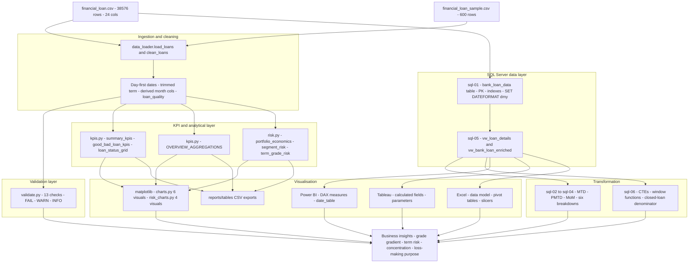
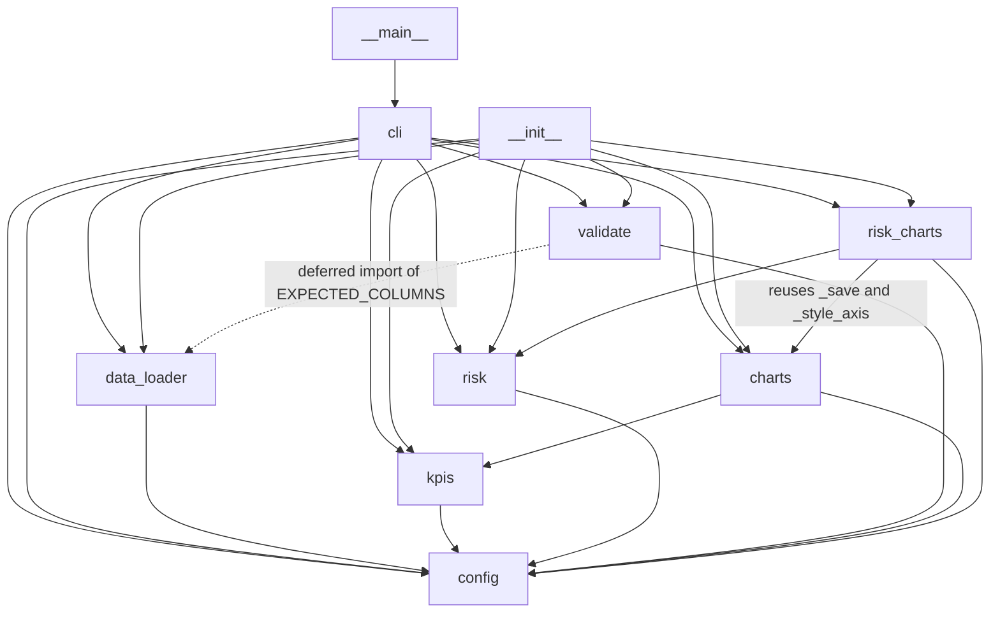
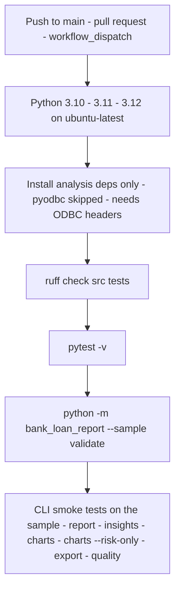

# Architecture

This project turns one flat file of consumer loan records into a reconciled reporting
layer. A single source CSV of 38,576 loans and 24 columns is ingested and cleaned once
(day-first dates parsed, the leading space stripped from `term`, derived month and
loan-quality columns added), loaded into a Microsoft SQL Server table that carries the
declared types and the primary key, transformed there into two reusable views
(`dbo.vw_loan_details` and `dbo.vw_bank_loan_enriched`), aggregated into the five
headline KPIs plus the six Overview breakdowns, extended with a risk and profitability
layer that answers whether the lending was any good, checked against an executable
data-quality contract, and finally presented four ways — Power BI, Tableau, Excel and
matplotlib — all of which must agree with the same reference numbers. The same KPIs are
computed independently in T-SQL, in DAX and in pandas; that duplication is the
reconciliation mechanism, not an accident.

---

## 1. End-to-end data flow



Note the two entry points into the storage layer: the BI tools connect to
`dbo.vw_bank_loan_enriched` so the derived columns are defined once in the database,
while the Python package reads the CSV directly. Both paths are expected to produce the
same figures, and section 6 explains how that is enforced.

---

## 2. Python package module dependency graph

Derived from the actual `import` statements in `src/bank_loan_report/`.



The graph is acyclic and `config` is a leaf that imports nothing from the package. That
shape is deliberate: `config` holds the business rules (`GOOD_LOAN_STATUSES`,
`BAD_LOAN_STATUSES`, `SOURCE_DATE_FORMAT`, `DATE_COLUMNS`) so that every other module
reads the same definitions instead of restating them. `validate` imports
`EXPECTED_COLUMNS` from `data_loader` inside the two functions that need it rather than
at module scope, which keeps the two modules loosely coupled.

---

## 3. Validation and testing layer

Diagram of what the CI job runs, in order:



| Stage | Runs on | What it gates |
|---|---|---|
| `ruff check src tests` | source tree only | Lint rules `E`, `F`, `I`, `UP`, `B` at line length 100. Blocks the job on any violation. |
| `pytest -v` — `tests/test_kpis.py` | bundled 600-row sample in CI; full dataset locally | Column presence, datetime parsing, day-first dates, trimmed `term`, unique ids, derived columns, ordered `emp_length`, good/bad partition, adjacency of MTD and PMTD, every Overview breakdown summing back to the dataset totals, and that all six Overview charts render to files larger than 1,000 bytes. |
| `pytest -v` — `tests/test_risk.py` | sample in CI; full dataset locally | Risk-flag columns present, banded columns covering every row, net margin reconciling to received minus funded, per-status rows summing to the Total portfolio row, recovery rate consistent with its inputs, volume floors respected, `risk_multiple` consistent, ranking monotone. |
| `pytest -v` — `tests/test_validate.py` | sample in CI; full dataset locally | That no `FAIL`-severity check fails, that check names are unique and every result carries a detail string, and — via eight negative tests that deliberately corrupt a copy of the data — that each check can actually fail. |
| `pytest -v` — `tests/test_sql.py` | the `.sql` files as text, via `sqlglot` | Every script parses as T-SQL, filenames are numbered `01`–`06` in run order, no mis-cased status literal such as `'Charged off'`, `SET DATEFORMAT dmy` precedes the `BULK INSERT`, period boundaries are derived from `MAX(issue_date)` with `DATEFROMPARTS` and contain no `DD-MM-YYYY` literals, no destructive verb outside `01`, and `sql/06` really does contain `ROW_NUMBER()`, `RANK()`, `DENSE_RANK()`, `NTILE(`, `LAG(`, `OVER (`, `PARTITION BY`, at least five CTEs, a join, at least three `HAVING COUNT(*) >=` floors, the closed-loan caveat, and a reference to `docs/DATA_QUALITY.md`. |
| `python -m bank_loan_report --sample validate` | bundled sample | Exits non-zero if any `FAIL`-severity check fails, which is the gate on "a published KPI would be wrong". |
| CLI smoke tests | bundled sample | That every subcommand still runs end to end and writes its outputs. |

Exact-figure tests are marked `requires_full` and skip themselves when
`data/raw/financial_loan.csv` is absent, so CI validates structure and business rules
on the sample while the full-dataset figures are asserted locally.

---

## 4. Why each technology is here

### The raw CSV — `data/raw/financial_loan.csv`

It is the single source of truth and the only thing in the stack that is not derived.
Everything else — the SQL table, the views, the DataFrame, the Power BI model — is a
projection of these 38,576 rows. It is deliberately *not* committed (only a 600-row
sample is), because it belongs to the original specification author; `scripts/download_data.py`
fingerprints the file once it is in place, checking 38,576 rows, 24 columns,
`loan_amount` summing to 435,757,075 and `total_payment` to 473,070,933. Remove the CSV
and there is no project: the code falls back to the sample, which cannot reproduce any
of the headline figures.

### pandas

pandas is the reference implementation. It is where the cleaning contract is defined,
where the KPIs are computed in code that a test can assert against, and where the risk
layer lives. Its role is not "the Python option" — it is the arbiter. Because the SQL
scripts cannot be executed in CI, the pandas results are what make the T-SQL
trustworthy: `tests/test_risk.py::test_term_grade_risk_matches_sql_06_section_7`
asserts the exact figures written into the comments of `sql/06`. Remove pandas and the
SQL layer becomes a set of unverified claims, the tests have nothing to run against, and
the charts have no data source.

### SQL Server and T-SQL

The dataset is a flat file, so a relational layer is not needed for volume. It is there
for three things a CSV cannot give: declared types with `issue_date` as a real `DATE`
and `id` as a primary key (`sql/01`), a place to define derived columns once for every
downstream BI tool (`dbo.vw_bank_loan_enriched` in `sql/05`), and a query language with
window functions and CTEs for the analysis in `sql/06` that plain `GROUP BY` cannot
express — `RANK`, `LAG`, `NTILE`, running totals over an ordered frame, and a
`CROSS JOIN` against a single-row benchmark CTE. `SET DATEFORMAT dmy` in `sql/01` is
load-critical: without it SQL Server reads the `DD-MM-YYYY` dates month-first for every
day of the month up to 12, silently, and every time-sliced KPI moves. Remove the SQL
layer and Power BI, Excel and Tableau each have to re-derive `term_clean`, `issue_month`
and `loan_quality` on their own, which is exactly how three tools drift to three
answers.

### The Python package layout — `src/bank_loan_report/`

A `src/` layout with an installable package (`pyproject.toml`, `pip install -e .`,
console script `bank-loan-report`) rather than a folder of scripts. It exists so the
tests can `from bank_loan_report import ...` against the installed package instead of
relying on relative paths, so the CLI is a single documented entry point, and so the
layers are enforced by the import graph rather than by convention: `config` at the
bottom, `data_loader` above it, `kpis`/`risk`/`validate` above that, `charts`/
`risk_charts` above those, `cli` on top. Collapse this into one script and the acyclic
structure in section 2 stops being checkable, and `config` stops being the one place the
good/bad rule is written.

### matplotlib

matplotlib is the only visualisation layer in the repository that a machine can verify.
The `.pbix`, `.twbx` and `.xlsx` binaries are not committed, so without matplotlib
there would be no chart artefact under version control and no test could assert that a
visual renders. `charts.py` calls `matplotlib.use("Agg")` before importing `pyplot`,
which is what allows charts to render headlessly in CI, and `test_all_charts_render`
asserts six files exist and are non-trivial in size. It also carries analytical
decisions that the BI specs do not: the break-even reference line at 100 percent in
`recovery_by_purpose`, and `_volume_floor`, which suppresses thin segments as a share of
the dataset so the same panel chart is honest on both the full data and the 600-row
sample.

### Power BI and DAX

Power BI is the delivery format the problem statement asks for: three linked pages with
synced slicers and a single slicer driving all six Overview visuals. DAX earns its place
because of the filter-context measures that would otherwise have to be pre-aggregated:
`DATESMTD` for the month-to-date figures, `DATESMTD(DATEADD(date_table[Date], -1,
MONTH))` for previous-month-to-date, `DIVIDE` for month-over-month with a safe
denominator, and the `SWITCH` over a disconnected `measure_selection` table that makes
one slicer repoint six visuals. Written as DAX the rules stay legible and diffable;
built with Power BI groups instead, as the original specification does, the good/bad definition
becomes invisible in source control. Remove Power BI and the interactive deliverable
disappears along with the second independent computation of the headline KPIs.

### The Power BI calendar table

`calendar_table.dax` builds a dedicated `date_table` with `CALENDAR` from the first of
`MIN(issue_date)`'s year to 31 December of `MAX(issue_date)`'s year, marked as a date
table on `Date` and related one-to-many to `bank_loan_data[issue_date]` in a single
direction. It is not decoration. The time-intelligence functions require a marked date
table with a contiguous, gap-free set of dates; `issue_date` in this dataset stops on
2021-12-12, so measures anchored on the fact table alone would sit on an incomplete
December and a calendar with holes. It also supplies the sort keys — `Month Name` and
`Month Short` sorted by `Month Number` — without which the monthly line chart reads
April, August, December. Remove the calendar table and `DATESMTD`, `DATEADD` and every
MTD, PMTD and MoM measure become unreliable, while the totals keep looking correct.

### Tableau

Tableau is the second BI implementation, and it exists to prove the reporting layer is
tool-independent rather than an artefact of one product's semantics. It also forces the
same rules to be restated in a genuinely different dialect — a fixed level-of-detail
expression `{ FIXED : MAX(DATETRUNC('month', [Issue Date])) }` for the reporting anchor,
`DATEPARSE("dd-MM-yyyy", [Issue Date])` for the day-first dates on the CSV path, and an
`IF`/`ELSEIF` or `CASE` parameter in place of Power BI's `SWITCH`, which Tableau does
not have. Getting the same 38,576 / $435,757,075 / $473,070,933 out of both tools is a
stronger statement than getting it out of one. Remove Tableau and that
cross-tool claim narrows to a single vendor.

### Excel

Excel is the lowest-common-denominator deliverable: the version a stakeholder can open
without a licence or a server. Architecturally it is also the cheapest place to make a
unit mistake, which is why the build guide is explicit that `int_rate` and `dti` load
into the data model as decimal fractions and must be formatted as Percentage rather than
multiplied — multiply *and* format and every rate reads 100 times too high. The guide
loads to the data model with "Only Create Connection" rather than onto a sheet, so all
eleven pivot tables share one cache and one set of slicers, and it insists on wiring
Report Connections for every slicer to every pivot, without which the slicers filter one
chart and quietly leave the rest stale. Remove Excel and the project loses its
no-dependency distribution path.

### pytest

pytest is what stops the documentation drifting away from the code. It plays two
distinct roles here. As invariant testing it asserts relationships that must hold on any
slice — every breakdown summing back to the dataset totals, net margin equalling
received minus funded, shares summing to 100, rates bounded. As regression testing it
pins the exact figures quoted in the README, in `sql/06`'s comments and in this
documentation, behind a `requires_full` skip so the suite still runs on the sample. The
negative tests in `tests/test_validate.py` matter as much: a check that can never fail
is worthless, so eight tests corrupt a copy of the data and assert the relevant check
flips. Remove pytest and every number in every document becomes a claim nobody
re-checks.

### ruff

ruff is the fast structural gate that runs before the tests in CI, with `E`, `F`, `I`,
`UP` and `B` selected. `F` catches the genuine defect class in an analysis codebase —
unused or undefined names, typically a stale import left behind after a refactor — and
`I` keeps import order deterministic so diffs stay about behaviour. It is also why the
deliberate exceptions in the code are annotated rather than accidental: the
`matplotlib.use("Agg")` call before the `pyplot` import carries explicit `# noqa: E402`
markers, which documents that the ordering is intentional. Remove ruff and this
signal is lost.

### sqlglot

sqlglot is what makes an un-executable SQL layer testable. There is no SQL Server in CI,
so `tests/test_sql.py` parses each script as T-SQL instead — splitting on the `GO` batch
separator first, because `GO` is a client directive and not a statement a parser will
accept. That catches the errors that actually happen in hand-written SQL: typos,
unbalanced parentheses, a stray comma before `FROM`. On top of parsing it enables text
assertions about the scripts' content: consistent business-rule spelling, the
`DATEFORMAT` ordering, derived rather than hard-coded period boundaries, volume floors,
and no destructive verbs outside the load script. It is a dev-only dependency and the
tests `importorskip` rather than fail if it is absent. Remove sqlglot and six of the
project's SQL guarantees become "reviewed by hand".

### GitHub Actions

CI is what converts all of the above from things that can be run into things that are
run, on three Python versions, on every push and pull request. It also encodes an
environment constraint honestly: `pyodbc` needs system ODBC headers, so the workflow
installs the analysis dependencies explicitly and then `pip install -e . --no-deps`,
rather than pretending a database driver is available. The ordering is a gate, not a
list — lint, then tests, then `validate` on the sample with its non-zero exit, then the
CLI smoke tests. Remove GitHub Actions and nothing guarantees the repository still works
on a machine that is not the author's.

### The `.env` and `config` approach

No credential, server name or absolute path is hard-coded. `config.py` reads
`DB_SERVER`, `DB_PORT`, `DB_NAME`, `DB_TABLE`, `DB_USER`, `DB_PASSWORD`, `DB_DRIVER`,
`DB_TRUSTED_CONNECTION`, `DATA_DIR`, `REPORTS_DIR` and `RAW_CSV_NAME` from the
environment with sane defaults, optionally loading a local `.env` through
`python-dotenv` inside a `try` so the package still imports when dotenv is not
installed. `DatabaseSettings.sqlalchemy_url()` builds the connection string with
`quote_plus` on the driver, username and password, supports Windows trusted connections,
and raises a clear `RuntimeError` when neither credentials nor trusted connection are
configured instead of emitting a broken URL. `.env.example` is committed; `.env` is not.
Remove this indirection and the repository either leaks a password or only runs on one
machine — and `PROJECT_ROOT`-relative paths are what let CI redirect outputs to
`/tmp/figures` and `/tmp/tables` without touching the code.

---

## 5. Layer boundaries and contracts

Each layer promises something specific to the layer above it, and each promise has a
check behind it.

| Layer | Guarantees to the next layer | Enforced by |
|---|---|---|
| Raw CSV | 24 named columns, one row per loan, `DD-MM-YYYY` date strings, `int_rate` and `dti` as decimal fractions, `term` values carrying a leading space | `scripts/download_data.py` fingerprint; `EXPECTED_COLUMNS` check on load |
| `data_loader.load_loans` | Raises rather than returning a partial frame if any expected column is missing; resolves the dataset by explicit path, then raw CSV, then bundled sample | `resolve_data_path`, `load_loans`; `test_missing_column_is_detected` |
| `data_loader.clean_loans` | The four date columns are real datetimes parsed with `%d-%m-%Y`; all text columns are stripped, so `term` is `36 months` / `60 months`; `issue_month`, `issue_year`, `issue_month_name`, `issue_month_short` exist; `loan_quality` is `Good Loan`, `Bad Loan` or `Unclassified` — never a silent bucket; `emp_length` is an ordered categorical from `< 1 year` to `10+ years`; `int_rate` and `dti` are left as fractions and never scaled here | `tests/test_kpis.py`; `validate.check_term_trimmed`, `check_dates_are_day_first`, `check_rates_are_fractions` |
| `validate.run_all` | One `CheckResult` per check with a non-empty detail string and a severity in `FAIL`/`WARN`/`INFO`; `blocking_failures` returns only failed `FAIL` checks, so `WARN` and `INFO` can never block | `tests/test_validate.py` |
| `kpis` | Rates are returned already multiplied by 100 exactly once, so no caller may scale again; MTD is the latest month present by `issue_date` and PMTD the calendar month before it, never a hard-coded December; `mom_change` returns 0.0 on a zero denominator; every Overview breakdown sums back to the dataset totals | `test_rates_are_percentages`, `test_periods_are_adjacent`, `test_mom_change_handles_zero_denominator`, `test_every_aggregation_reconciles` |
| `risk` | `add_risk_flags` never mutates its input; `dti_band`, `income_quintile` and `loan_size_band` cover every row with no NaN band; `net_margin` is exactly received minus funded; realised-risk tables use the closed-loan denominator and say so; every segment cut applies a `min_loans` floor | `tests/test_risk.py` |
| `charts` / `risk_charts` | Render headlessly under the Agg backend; return the written `Path` or `None`; never invent a segment that fell below the volume floor — the panel says "no segment with >= N loans" instead | `test_all_charts_render`; `_volume_floor` |
| SQL data layer | `id` is the primary key; date columns are `DATE`; `term_clean`, `issue_year`, `issue_month`, `issue_month_name`, `issue_month_short` and `loan_quality` are defined once in `vw_bank_loan_enriched` for every BI tool | `sql/01`, `sql/05`; `tests/test_sql.py` |
| BI layers | Must reproduce the reference numbers in `docs/VERIFICATION.md`; if a dashboard disagrees, the dashboard is wrong | Per-tool validation sections in `powerbi/README.md`, `excel/README.md`, `tableau/calculated_fields.md` |

---

## 6. Two parallel implementations of the same KPIs — why

The headline KPIs are computed three times: in T-SQL (`sql/02`–`sql/04`), in DAX
(`powerbi/measures.dax`, mirrored in Tableau calculated fields and Excel pivots), and in
pandas (`src/bank_loan_report/kpis.py`). This is not an oversight and it is not a
portfolio flourish. Three independent implementations of the same definition are a
reconciliation instrument: agreement is evidence that the definition itself is
unambiguous, and any disagreement localises the bug to one layer instead of leaving a
number in doubt.

It also solves a concrete problem in this repository. The SQL scripts are never executed
in CI, because no SQL Server instance is available. What makes them trustworthy is that
their logic is restated in pandas and asserted against exact values — the comment blocks
in `sql/06` quote figures that `tests/test_risk.py` recomputes and checks. Likewise, the
BI layers ship as build specifications rather than binaries, so the only way a rebuilt
`.pbix` can be validated is against numbers produced elsewhere.

The reconciled figures, all machine-computed from the full dataset:

| KPI | Total | MTD — Dec 2021 | PMTD — Nov 2021 | MoM |
|---|---|---|---|---|
| Total Loan Applications | 38,576 | 4,314 | 4,035 | +6.91% |
| Total Funded Amount | $435,757,075 | $53,981,425 | $47,754,825 | +13.04% |
| Total Amount Received | $473,070,933 | $58,074,380 | $50,132,030 | +15.84% |
| Average Interest Rate | 12.0488% | 12.3560% | 11.9417% | +3.47% |
| Average DTI | 13.3274% | 13.6655% | 13.3027% | +2.73% |

Good loan versus bad loan:

| Category | Statuses included | Share | Applications | Funded | Received |
|---|---|---|---|---|---|
| Good Loan | Fully Paid, Current | 86.1753% | 33,243 | $370,224,850 | $435,786,170 |
| Bad Loan | Charged Off | 13.8247% | 5,333 | $65,532,225 | $37,284,763 |

Loan status grid:

| Loan status | Applications | Funded | Received | MTD funded | MTD received | Avg int rate | Avg DTI |
|---|---|---|---|---|---|---|---|
| Charged Off | 5,333 | $65,532,225 | $37,284,763 | $8,732,775 | $5,324,211 | 13.88% | 14.00% |
| Current | 1,098 | $18,866,500 | $24,199,914 | $3,946,625 | $4,934,318 | 15.10% | 14.72% |
| Fully Paid | 32,145 | $351,358,350 | $411,586,256 | $41,302,025 | $47,815,851 | 11.64% | 13.17% |

The risk layer reconciles the same way. `sql/06` section 7 and `risk.term_grade_risk`
both benchmark term-by-grade default rates against a closed-loan portfolio rate of
14.2297% — as against 13.8247% on all loans, because loans still `Current` have not had
the opportunity to default — and both identify 60-month grade F as the worst segment
at 34.22% on 751 loans and 36-month grade A as the best at 5.57% on 9,274 loans, with
13 segments clearing the 100-loan floor. Portfolio-wide, funded $435,757,075 against
received $473,070,933 gives a net margin of $37,313,858 and a recovery rate of 108.56%,
while charge-offs recover 56.90% of principal and cost 6.48% of everything lent.

If a rebuilt dashboard disagrees with any figure above, the dashboard is wrong. That is
the entire point of computing them more than once.

---

## 7. Execution order — how to run the whole thing

Install, using the real Makefile targets:

```bash
make install          # pip install -r requirements-dev.txt && pip install -e .
```

Get the data in place — the full CSV is not committed:

```bash
python scripts/download_data.py    # prints where to put the file, then fingerprints it
```

Run the pipeline. `make all` is `validate report charts export`, in that order, so a
blocking data-quality failure stops the run before anything is published:

```bash
make validate         # python -m bank_loan_report validate   (non-zero exit on a blocking failure)
make report           # python -m bank_loan_report report     (Summary + Overview dashboards)
make charts           # python -m bank_loan_report charts     (PNGs to reports/figures/)
make export           # python -m bank_loan_report export     (CSVs to reports/tables/)
make insights         # python -m bank_loan_report insights   (risk and profitability tables)
make all              # validate, then report, charts and export
```

Quality gates:

```bash
make lint             # ruff check src tests
make test             # pytest
make notebook         # jupyter notebook notebooks/01_bank_loan_analysis.ipynb
make clean            # remove generated outputs and caches
```

The CLI directly, when you need its options:

```bash
python -m bank_loan_report report
python -m bank_loan_report --sample report                  # bundled 600-row sample
python -m bank_loan_report --data path/to/other.csv report   # explicit dataset
python -m bank_loan_report quality                          # per-column null/dtype/distinct report
python -m bank_loan_report validate
python -m bank_loan_report insights
python -m bank_loan_report charts --outdir reports/figures
python -m bank_loan_report charts --risk-only --outdir reports/figures
python -m bank_loan_report export --outdir reports/tables
```

The SQL layer, in Microsoft SQL Server, strictly in numbered order — `01` creates the
database, table, indexes and sets `DATEFORMAT dmy`; `05` creates the views the BI tools
consume; `06` is the analytical script:

```
sql/01_schema_and_load.sql
sql/02_summary_kpis.sql
sql/03_good_bad_loan.sql
sql/04_overview_charts.sql
sql/05_details_and_quality.sql
sql/06_risk_and_cohort_analysis.sql
```

The BI layers are rebuilt from their specifications and validated against
`docs/VERIFICATION.md`: `powerbi/power_query_steps.md` then `powerbi/calendar_table.dax`
then `powerbi/measures.dax` following `powerbi/README.md`;
`tableau/calculated_fields.md`; `excel/README.md`.

---

## 8. Architectural limitations

Stated plainly, because each one is a real constraint on what this repository can claim.

1. **No orchestration.** There is no scheduler, DAG or dependency engine. Order is
   enforced by a Makefile target list and by numbered SQL filenames. Nothing prevents
   someone running `sql/04` before `sql/01`, and nothing reruns a downstream step when
   an upstream one changes.
2. **No incremental loads.** Every step is a full recompute over the whole file. The
   `BULK INSERT` in `sql/01` is a full load into a table the script drops first; the
   Python layer reads the entire CSV on every invocation. There is no watermark, no
   change-data capture and no append path.
3. **The SQL is not executed in CI.** No SQL Server instance was available, so
   `sql/01`–`sql/06` are statically parsed and text-asserted only. Their correctness
   rests on the pandas reimplementation agreeing with the figures written in their
   comments. Running the scripts against a real instance remains outstanding.
4. **Single-file source.** One CSV, one grain, one calendar year. There is no borrower
   dimension to join to, no payment-level history and no second fact table, so nothing
   in this architecture exercises referential integrity or multi-table modelling.
5. **The dashboard binaries are not committed.** `.pbix`, `.xlsx` and `.twbx` cannot be
   reconstructed from a video recording. What is version-controlled is a complete build
   specification per tool plus the reference numbers to validate a rebuild — but the
   exact layout, colour values, fonts and background images of the originals are not
   recoverable, and no automated check can confirm a rebuilt dashboard matches.
6. **Source data defects constrain the analysis, not just the tooling.** The date
   columns other than `issue_date` are not internally consistent, which rules out
   vintage, seasoning, time-to-default and cohort-performance analysis entirely. See
   `docs/DATA_QUALITY.md`.
