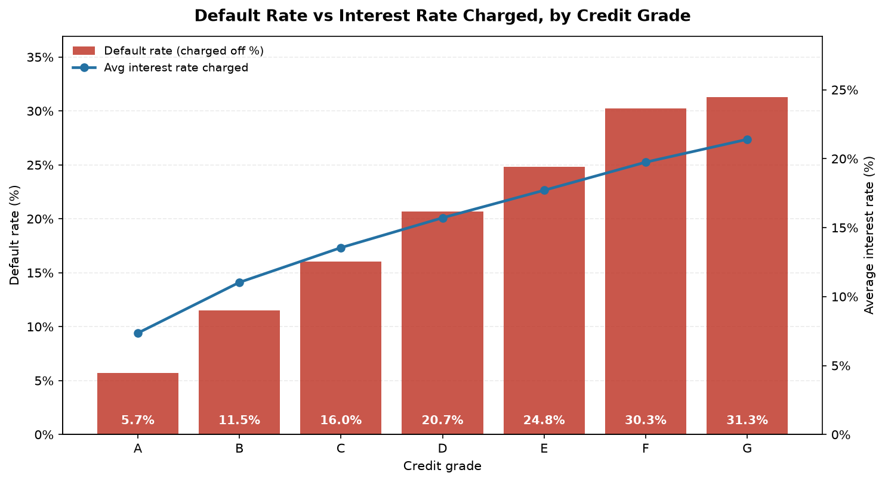
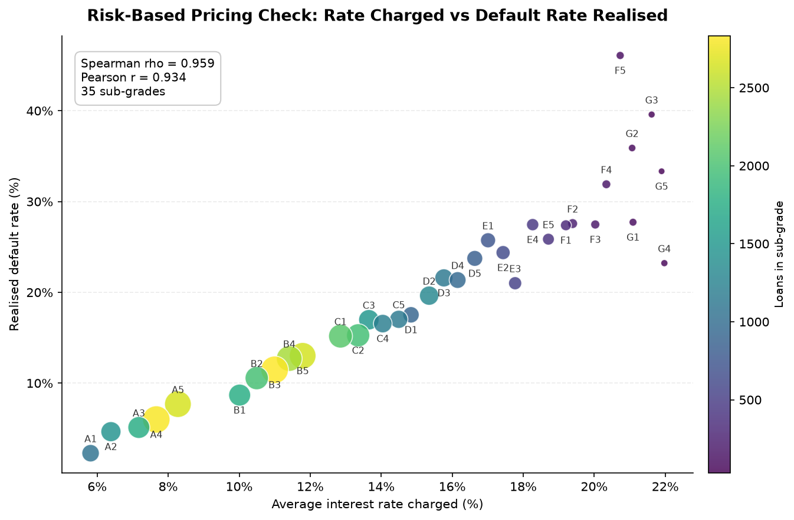
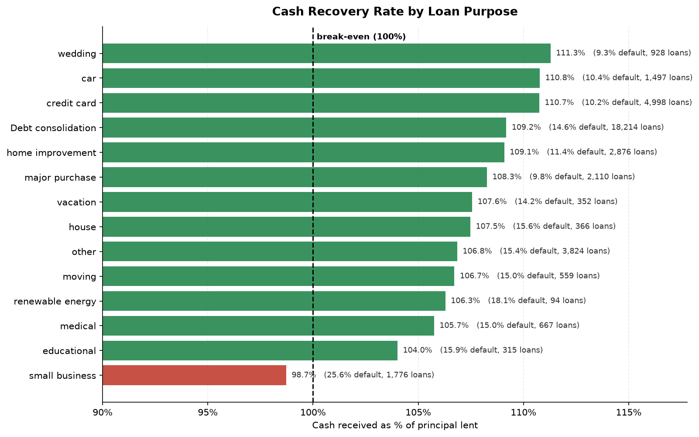
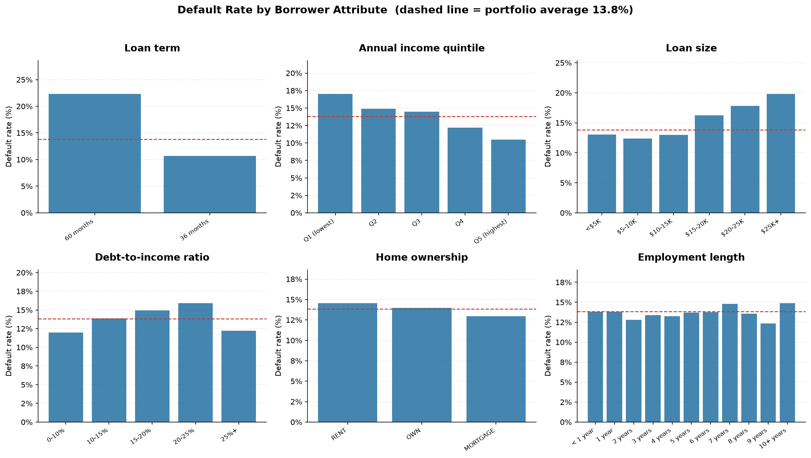
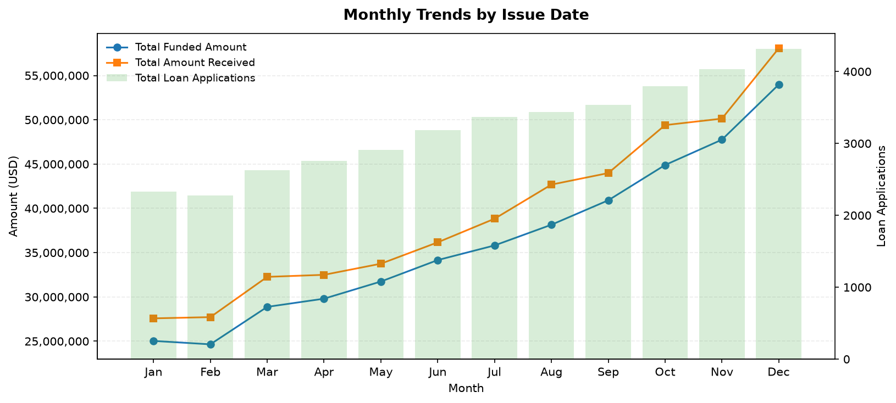

# Business Insights

What this loan book actually says, and how each number was produced.

Every figure on this page is computed by
[`src/bank_loan_report/risk.py`](../src/bank_loan_report/risk.py) from the full
38,576-row dataset and can be regenerated with:

```bash
python -m bank_loan_report insights          # prints every table below
python -m bank_loan_report export            # writes them to reports/tables/*.csv
```

The same analysis is expressed in T-SQL in
[`sql/06_risk_and_cohort_analysis.sql`](../sql/06_risk_and_cohort_analysis.sql).
Figures quoted here are asserted in [`tests/test_risk.py`](../tests/test_risk.py),
so this document cannot drift away from the code without the test suite failing.

**Scope note.** This is a static, one-year extract (originations from
2021-01-01 to 2021-12-12). It supports cross-sectional analysis — how outcomes
differ *between* segments. It does **not** support time-to-event analysis,
because the non-origination date columns are internally inconsistent; see
[`DATA_QUALITY.md`](DATA_QUALITY.md). Nothing on this page depends on those
columns.

---

## The headline: the book is profitable, and charge-offs cost 6.5% of everything lent

| Measure | Value |
| --- | --- |
| Loans in book | 38,576 |
| Total funded (principal lent) | $435,757,075 |
| Total received (cash back) | $473,070,933 |
| Net cash margin | **+$37,313,858** |
| Portfolio recovery rate | **108.56%** |
| Default rate, all loans | 13.82% |
| Default rate, closed loans only | **14.23%** |
| Recovery on charged-off loans | 56.90% |
| Net cash lost to charge-offs | $28,247,462 |
| Charge-off loss as share of funded | **6.48%** |

Read across the loan statuses and the mechanism is clear:

| Status | Loans | Funded | Received | Recovery | Net cash |
| --- | --- | --- | --- | --- | --- |
| Fully Paid | 32,145 | $351,358,350 | $411,586,256 | 117.14% | +$60,227,906 |
| Current | 1,098 | $18,866,500 | $24,199,914 | 128.27% | +$5,333,414 |
| Charged Off | 5,333 | $65,532,225 | $37,284,763 | 56.90% | **−$28,247,462** |

**Insight.** A charged-off loan is not a total loss — on average the bank still
recovers 56.9 cents on the dollar before writing it off. That single number
changes how the portfolio should be read: the interest collected on 32,145
performing loans more than covers the 43.1% not recovered on 5,333 failures,
and the book clears break-even by $37.3M.

**Why the two default rates differ.** 13.82% counts all 38,576 loans. But
1,098 loans are still `Current` — they have not had the opportunity to default
yet, so including them in the denominator flatters the number. Restricting to
closed loans (`Fully Paid` + `Charged Off`, 37,478 loans) gives 14.23%, which
is the realised credit-loss frequency. Both are reported; the second is the one
used wherever this project measures risk.

---

## Finding 1 — The credit grading model works, and the pricing tracks it



| Grade | Loans | Default rate | Avg interest rate | Recovery | Net cash |
| --- | --- | --- | --- | --- | --- |
| A | 9,689 | 5.70% | 7.35% | 104.51% | +$3.80M |
| B | 11,674 | 11.50% | 11.03% | 107.71% | +$10.07M |
| C | 7,904 | 16.02% | 13.55% | 109.74% | +$8.52M |
| D | 5,182 | 20.69% | 15.71% | 110.80% | +$6.90M |
| E | 2,786 | 24.80% | 17.71% | 111.32% | +$5.00M |
| F | 1,028 | 30.25% | 19.74% | 111.14% | +$2.11M |
| G | 313 | 31.31% | 21.40% | 114.46% | +$0.92M |

**Insight.** Default risk rises monotonically across all seven grades — no
reversals — from 5.70% at A to 31.31% at G, a 5.5× spread. The average interest
rate rises monotonically alongside it, 7.35% to 21.40%. This is the single most
important validation in the whole dataset: the grade assigned at underwriting
genuinely predicts the outcome, and the bank charges for it.

Note the recovery column: **every grade recovers more than 100% of principal.**
The riskiest grades are not loss-making; the higher rate compensates for the
higher failure frequency. Grade G recovers the most (114.46%) despite defaulting
the most.

Monotonicity is asserted, not eyeballed:
`test_grade_default_gradient_is_monotonic` and
`test_grade_interest_rate_gradient_is_monotonic`.

### The same finding at higher resolution



Across the 35 sub-grades with at least 20 loans, the rank correlation between
the average interest rate charged and the default rate subsequently realised is
**Spearman ρ = 0.959** (Pearson r = 0.934).

**Insight.** Risk-based pricing is not just directionally right at the
seven-grade level; it is almost perfectly rank-ordered at the 35-bucket level.
If the grade were decorative, this correlation would be weak. It is not.

The extremes are far apart: F5 defaults at 46.09% (115 loans) while A1 defaults
at 2.28% — a 20× spread between the worst and best sub-grade.

**Business question answered.** "Is our risk model earning its keep, or are we
just charging more and hoping?" — It is earning its keep.

---

## Finding 2 — Small business is the only product that loses money



Of the 14 loan purposes, thirteen recover more than 100% of principal. One does
not:

| Purpose | Loans | Default rate | Recovery | Net cash |
| --- | --- | --- | --- | --- |
| **small business** | 1,776 | **25.62%** | **98.72%** | **−$308,283** |
| renewable energy | 94 | 18.09% | 106.29% | +$53,181 |
| educational | 315 | 15.87% | 104.01% | +$86,730 |
| house | 366 | 15.57% | 107.47% | +$360,613 |
| other | 3,824 | 15.35% | 106.85% | +$2.13M |
| moving | 559 | 15.03% | 106.72% | +$251,774 |
| medical | 667 | 14.99% | 105.75% | +$318,147 |
| Debt consolidation | 18,214 | 14.55% | 109.18% | +$21.34M |
| vacation | 352 | 14.20% | 107.56% | +$148,788 |
| home improvement | 2,876 | 11.37% | 109.09% | +$3.03M |
| car | 1,497 | 10.35% | 110.77% | +$1.10M |
| credit card | 4,998 | 10.16% | 110.75% | +$6.33M |
| major purchase | 2,110 | 9.76% | 108.26% | +$1.43M |
| wedding | 928 | 9.27% | 111.28% | +$1.04M |

**Insight.** Small-business lending defaults at 25.62% — 1.85× the portfolio
average — and the interest charged does not cover it. Its average rate is
13.03%, which is *lower* than grade C's 13.55% despite a default rate closer to
grade E's. That is the actual problem: this product is mispriced relative to the
risk it carries, not merely risky.

**Recommendation this supports.** Reprice or tighten small-business criteria.
Note what the data does *not* support: withdrawing the product. It is 4.6% of
loans and its loss is $308K against a $37.3M portfolio margin — a pricing
correction, not an exit decision.

**Business question answered.** "Which products are we underwriting at a loss?"
— Exactly one, and by a small margin that a rate adjustment would close.

---

## Finding 3 — Term is an independent risk factor that the dashboard hides

The reference dashboards show loan term as a volume split: 28,237 loans (73.2%)
at 36 months, 10,339 (26.8%) at 60 months. That framing conceals the important
part.

| Term | Loans | Default rate | Avg interest rate | Recovery |
| --- | --- | --- | --- | --- |
| 36 months | 28,237 | 10.71% | 11.03% | 107.94% |
| 60 months | 10,339 | **22.34%** | 14.83% | 109.62% |

**Insight.** 60-month loans default at **2.09×** the 36-month rate. The effect
survives controlling for grade — within every grade, the longer term is
materially worse (closed loans only, benchmark 14.23%):

| Term × grade | Loans | Default rate | vs portfolio |
| --- | --- | --- | --- |
| 60mo F | 751 | 34.22% | 2.40× |
| 60mo G | 240 | 32.08% | 2.25× |
| 60mo E | 1,758 | 29.75% | 2.09× |
| 60mo D | 1,806 | 28.68% | 2.02× |
| 36mo F | 206 | 26.21% | 1.84× |
| 60mo C | 2,034 | 23.55% | 1.65× |
| 36mo E | 853 | 19.70% | 1.38× |
| 60mo B | 2,272 | 18.53% | 1.30× |
| 36mo D | 3,160 | 17.53% | 1.23× |
| 36mo C | 5,613 | 14.02% | 0.99× |
| 36mo B | 9,075 | 10.16% | 0.71× |
| 60mo A | 380 | 9.21% | 0.65× |
| 36mo A | 9,274 | 5.57% | 0.39× |

**The nuance worth stating.** Term does not dominate grade. A 60-month grade A
loan (9.21%) is still safer than a 36-month grade B loan (10.16%). The ordering
is grade first, term second — so term belongs in the risk view as a secondary
dimension, not as a headline.

**Business question answered.** "Should term appear in our risk reporting, or
only in volume reporting?" — In risk reporting, crossed with grade.

---

## Finding 4 — Income and loan size predict default; employment length does not



### Income — a clean monotonic gradient

| Quintile | Median income | Loans | Default rate |
| --- | --- | --- | --- |
| Q1 (lowest) | $30,000 | 7,746 | 17.04% |
| Q2 | $45,000 | 7,686 | 14.90% |
| Q3 | $60,000 | 7,714 | 14.47% |
| Q4 | $76,900 | 7,746 | 12.20% |
| Q5 (highest) | $117,764 | 7,684 | 10.50% |

Monotonic with no reversals (asserted by `test_income_gradient_is_monotonic`).
The bottom quintile defaults at 1.62× the rate of the top.

### Loan size — bigger is riskier above $15K

| Band | Loans | Default rate |
| --- | --- | --- |
| < $5K | 9,113 | 13.05% |
| $5–10K | 12,578 | 12.36% |
| $10–15K | 7,842 | 12.96% |
| $15–20K | 4,507 | 16.24% |
| $20–25K | 2,953 | 17.85% |
| $25K+ | 1,583 | 19.84% |

**Insight.** Risk is flat below $15,000 and then climbs steadily — 19.84% above
$25K versus 12.36% in the $5–10K band. The break is at $15K, not at the mean
loan size ($11,296), which is where an exposure limit would sensibly sit.

### Debt-to-income — predictive, but the top band is thin

| DTI band | Loans | Default rate |
| --- | --- | --- |
| 0–10% | 12,803 | 12.00% |
| 10–15% | 9,653 | 13.87% |
| 15–20% | 8,851 | 14.96% |
| 20–25% | 6,623 | 15.93% |
| 25%+ | 646 | 12.23% |

The gradient is clean up to 25%. The apparent reversal in the top band is not a
finding: `dti` in this dataset is capped just under 0.30 (max 0.2999), so the
25%+ bucket holds only 646 loans and its average rate is the *lowest* in the
book (9.79%) — these are visibly a selected group who were approved despite
high DTI. Reading a risk conclusion from it would be a mistake.

### Home ownership — weak

| Status | Loans | Default rate |
| --- | --- | --- |
| RENT | 18,439 | 14.57% |
| OWN | 2,838 | 13.99% |
| MORTGAGE | 17,198 | 12.97% |
| OTHER | 98 | 18.37% |
| NONE | 3 | 0.00% |

Only 1.6 percentage points separate renters from mortgage holders. `OTHER` (98
loans) and `NONE` (3 loans) are below the volume floor used in the charts and
are excluded from them for that reason.

### Employment length — essentially no signal

Default rates across the eleven employment-length buckets span 12.35% (9 years)
to 14.90% (10+ years), and the pattern is non-monotonic — 10+ years is the
*worst* bucket. There is no usable ordering here.

**Insight.** This is a useful negative result. Employment length is one of the
reference dashboard's headline visuals, and it turns out to carry almost no
predictive information about default. Volume ≠ signal.

### The verification paradox — a trap, not a finding

| Verification status | Loans | Default rate |
| --- | --- | --- |
| Verified | 12,335 | 15.70% |
| Source Verified | 9,777 | 14.14% |
| Not Verified | 16,464 | 12.24% |

Read naively this says verifying income makes borrowers *more* likely to
default. That is a selection effect: lenders verify income when an application
looks marginal. Verified loans are also bigger (average $15,968 versus $8,485)
and higher-rate (13.09% versus 11.23%) — the verification flag is a proxy for
"this application needed scrutiny", not a cause of failure.

**This is deliberately included** because recognising a reversed-causation trap
is a more valuable thing to demonstrate than another clean gradient. No causal
claim is made anywhere in this project from this column.

---

## Finding 5 — Geographic concentration is material

| Dimension | Top 1 | Top 3 | Top 5 | Top 10 |
| --- | --- | --- | --- | --- |
| States (50 total) | 18.0% (CA) | 34.8% | 46.7% | 64.9% |
| Purposes (14 total) | 53.3% (Debt consolidation) | 74.5% | 87.2% | — |
| Grades (7 total) | 30.0% (B) | 69.4% | — | — |

**Insight.** California alone carries 18.0% of funded principal and the top ten
states carry 64.9% of it, across a 50-state book. A regional downturn in
California would hit this portfolio disproportionately. Separately, debt
consolidation is 53.3% of funded — the portfolio is effectively one product.

Default rates vary meaningfully by state among states with at least 300 loans:

| Worst | Rate | | Best | Rate |
| --- | --- | --- | --- | --- |
| NV | 20.95% | | TX | 11.30% |
| FL | 17.27% | | AL | 11.34% |
| MO | 15.76% | | PA | 11.40% |
| OR | 15.60% | | MA | 11.45% |
| CA | 15.33% | | CO | 11.82% |

Nevada defaults at 1.85× the Texas rate. California is both the largest
exposure and above the portfolio average (15.33%) — the concentration is in a
state that performs worse than average, which compounds the concern.

**Business question answered.** "What is our largest correlated exposure?" —
California, at 18.0% of funded, defaulting above the book average.

---

## Finding 6 — Lending grew 85% through the year; quality drifted slightly



| Month | Applications | Cohort default rate |
| --- | --- | --- |
| Jan 2021 | 2,332 | 13.25% |
| Feb | 2,279 | |
| Mar | 2,627 | |
| Apr | 2,755 | |
| May | 2,911 | |
| Jun | 3,184 | |
| Jul | 3,366 | |
| Aug | 3,441 | |
| Sep | 3,536 | |
| Oct | 3,796 | |
| Nov | 4,035 | |
| Dec 2021 | 4,314 | 15.04% |

Applications grew **+85.0%** January to December (funded amount grew **+115.7%**
— the average loan also got bigger). December month-on-month: +6.91%
applications, +13.04% funded.

**Insight, carefully stated.** The final observed default rate of each
origination month drifts from 13.25% to 15.04%. That is *consistent with*
underwriting loosening as volume was chased — but it is not proof. December
loans are also the youngest, and with this dataset's broken date columns there
is no way to control for seasoning. The honest reading is: worth flagging for
investigation with better data, not a conclusion.

**What cannot be done here.** No vintage curve, no time-to-default, no
seasoning analysis — 40.1% of rows have a `last_payment_date` earlier than
their `issue_date`. See [`DATA_QUALITY.md`](DATA_QUALITY.md). The monthly series
above is valid strictly as an origination-volume series.

---

## KPI definitions

For each metric: what it is, how it is calculated, why it matters, and the
business question it answers. Implementations are in
[`kpis.py`](../src/bank_loan_report/kpis.py) (dashboard KPIs) and
[`risk.py`](../src/bank_loan_report/risk.py) (risk KPIs); the SQL equivalents
are in `sql/02`–`sql/06` and the DAX equivalents in `powerbi/measures.dax`.

### Total applications
- **What.** The count of loan applications in the book.
- **How.** `COUNT(id)`. Verified: 38,576.
- **Why.** The volume denominator for everything else; the top-line demand measure.
- **Question.** "How much lending business did we write?"

### Total funded amount
- **What.** Principal lent.
- **How.** `SUM(loan_amount)`. Verified: $435,757,075.
- **Why.** Capital deployed, and the denominator of every recovery and loss rate.
- **Question.** "How much of our capital is at work?"

### Total amount received
- **What.** Cash collected — principal plus interest plus fees, net of nothing.
- **How.** `SUM(total_payment)`. Verified: $473,070,933.
- **Why.** The only measure of cash actually returned.
- **Question.** "How much came back?"

### Average interest rate
- **What.** Mean rate charged across loans.
- **How.** `AVG(int_rate) * 100`. Stored as a decimal fraction, so it is scaled
  exactly once. Verified: 12.0488%.
- **Why.** Portfolio yield, and the price of risk.
- **Question.** "What are we charging?"
- **Caveat.** This is an unweighted loan-count average, not an
  exposure-weighted one. A $35,000 loan counts the same as a $1,000 loan. That
  is how the original specification dashboard defines it and it is reproduced faithfully, but
  an exposure-weighted yield would be the better production measure.

### Average DTI
- **What.** Mean debt-to-income ratio of borrowers at origination.
- **How.** `AVG(dti) * 100`. Also a stored fraction. Verified: 13.3274%.
- **Why.** A leading indicator of borrower stress at underwriting time.
- **Question.** "How leveraged are the people we are lending to?"

### Good loan vs bad loan percentage
- **What.** Share of the book performing versus written off.
- **How.** Good = `loan_status IN ('Fully Paid','Current')`; Bad =
  `'Charged Off'`. Verified: 86.1753% good (33,243 loans) / 13.8247% bad
  (5,333 loans). Any status outside these three is classified `Unclassified`
  and raises a validation failure rather than being absorbed silently.
- **Why.** The headline credit-quality figure the business steers on.
- **Question.** "What share of the book has gone bad?"

### MTD / PMTD and MoM change
- **What.** Month-to-date, prior-month-to-date, and month-on-month growth.
- **How.** The MTD window is derived from `MAX(issue_date)` — never hard-coded
  — so it moves when the data is refreshed. Here that is December 2021 (MTD)
  and November 2021 (PMTD). MoM = `(current − prior) / prior * 100`.
  Verified: applications +6.91%, funded +13.04%, received +15.84%.
- **Why.** Direction of travel; a level with no trend is not actionable.
- **Question.** "Are we growing, and how fast?"

### Default rate
- **What.** Frequency of charge-off.
- **How.** All loans: `charged_off / total * 100` = 13.82%. Closed loans only:
  denominator restricted to `Fully Paid + Charged Off` = 14.23% on 37,478
  loans. Segment cuts always apply a minimum-volume floor.
- **Why.** The core credit-risk measure; the basis of every segment comparison
  on this page.
- **Question.** "How often do we lose money on a loan?"

### Recovery rate
- **What.** Cash returned as a percentage of principal lent.
- **How.** `SUM(total_payment) / SUM(loan_amount) * 100`. Above 100% means
  interest has exceeded the principal not returned. Verified: 108.56%
  portfolio-wide; 56.90% on charged-off loans.
- **Why.** Converts a default *count* into a cash outcome. A 25% default rate
  at 110% recovery is a better business than a 10% default rate at 95%.
- **Question.** "Is this segment profitable?"

### Net cash margin
- **What.** Absolute cash profit.
- **How.** `SUM(total_payment) − SUM(loan_amount)`. Verified: +$37,313,858.
- **Why.** Recovery rate is scale-blind; net margin says how much money the
  segment actually made. Used together they separate "unprofitable" from
  "small".
- **Question.** "How much did we make, and where?"

### Charge-off loss as share of funded
- **What.** Unrecovered principal on charged-off loans, against the whole book.
- **How.** `(charged_off_funded − charged_off_received) / total_funded * 100`.
  Verified: 6.48% ($28,247,462 of $435,757,075).
- **Why.** Translates credit losses into a single capital-efficiency number
  that can be compared against a target loss rate.
- **Question.** "What did credit risk cost us this year?"

### Pricing power (rank correlation)
- **What.** Correlation between the rate charged to a sub-grade and the default
  rate it realised.
- **How.** Spearman and Pearson correlation across sub-grades with at least 20
  loans. Verified: ρ = 0.959, r = 0.934, 35 sub-grades.
- **Why.** A direct test of whether the risk model is real. Spearman is the
  headline because only the *ordering* needs to hold.
- **Question.** "Does our grading system predict outcomes?"

### Concentration (top-N share)
- **What.** Share of funded principal held by the largest N members of a
  dimension.
- **How.** Cumulative `SUM(loan_amount)` over a descending order, divided by the
  total. Verified: CA 18.0%, top-3 states 34.8%, top-10 64.9%.
- **Why.** Default rates measure average risk; concentration measures
  correlated risk — the thing that turns a bad year into a solvency event.
- **Question.** "What single event could hurt us most?"

---

## What this analysis does not claim

Stated explicitly, because the boundary matters more than the findings:

1. **No causality.** Every relationship here is an association in one year of
   originations. The verification-status reversal is the clearest illustration
   of why that distinction is not pedantic.
2. **No time-to-event analysis.** Ruled out by the date defects in the source
   data, not by lack of effort.
3. **No predictive model.** There is no scoring model, no train/test split, no
   out-of-sample validation. This is descriptive and diagnostic analytics.
4. **No external benchmark.** Whether a 14.23% default rate is good or bad for
   this product class cannot be answered from this dataset alone.
5. **One year, one book.** No macroeconomic context, no rate cycle, no
   comparison period.

---

## Where the numbers come from

| Claim on this page | Produced by | Asserted by |
| --- | --- | --- |
| Portfolio economics | `risk.portfolio_economics` | `test_portfolio_economics_exact_values` |
| Default / recovery by grade, term, purpose | `risk.segment_risk` | `test_grade_default_gradient_is_monotonic`, `test_sixty_month_term_is_riskier` |
| Small business is the only loss-maker | `risk.unprofitable_segments` | `test_small_business_is_the_only_loss_making_purpose` |
| Spearman ρ = 0.959 | `risk.pricing_power` | `test_pricing_power_exact_values` |
| Term × grade table | `risk.term_grade_risk` | `test_term_grade_risk_matches_sql_06_section_7` |
| Concentration shares | `risk.concentration` | `test_concentration_exact_values` |
| Monthly growth | `risk.monthly_risk_trend` | `test_monthly_trend_growth` |
| Income gradient | `risk.segment_risk` on `income_quintile` | `test_income_gradient_is_monotonic` |
| Headline default rates | `risk.headline_risk_metrics` | `test_headline_default_rates` |

Run `make test` to check all of them.
